À propos du grand Dôme Mercurio 
===============================

Le grand dôme conçu par Mercurio permet de réaliser des acquisitions
automatiques d'images avec une lumière contrôlée. L'ensemble des données
récoltés à la fin de l'acquisition permet de générer un fichier **RTI**
(Reflectance Transformation Imaging)\
.

La technologie RTI est une méthode photographique qui capture la forme
et la couleur de la surface d'un objet et qui permet un éclairage
dynamique interactif de l'objet sur une interface numérique.\
Voici l'équipement nécessaire pour une acquisition RTI :

-   Un appareil photo reflex numérique (Canon de préférence)

```{=html}
<!-- -->
```
-   Un Dôme RTI Mercurio (Voir la figure
    [2](#fig:dome){reference-type="ref" reference="fig:dome"}),

```{=html}
<!-- -->
```
-   Un trépied vidéo : Pour la bonne stabilité du dôme lors des sessions
    d'acquisition, il est fortement conseillé de mettre un trépied
    \"lourd\" type vidéo (Voir la figure
    [1](#fig:pied){reference-type="ref" reference="fig:pied"}). Le dôme
    peut également être placé à l'horizontale pour acquérir un objet par
    dessus. Il devra pour cela être surélevé d'environ 15cm par rapport
    à la table.\

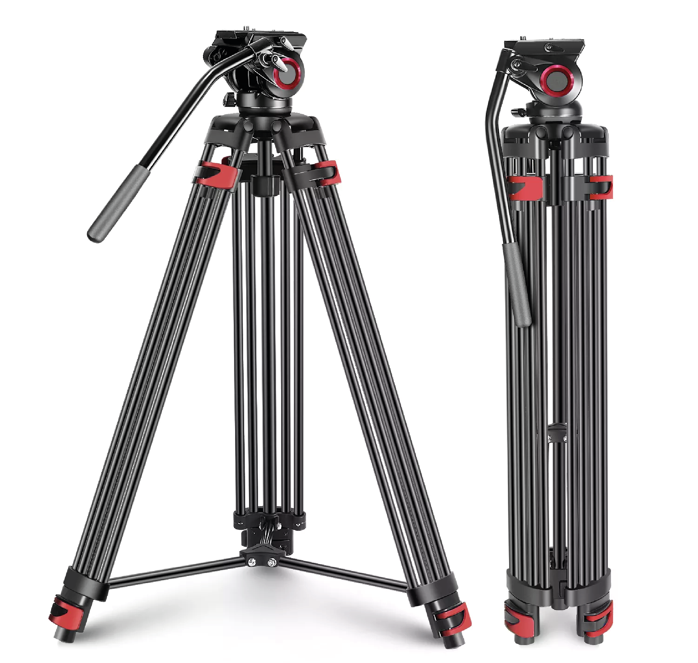{#fig:pied}

{#fig:dome}

Accessoires fournis avec le Dôme
================================

Boîtier de contrôle
-------------------

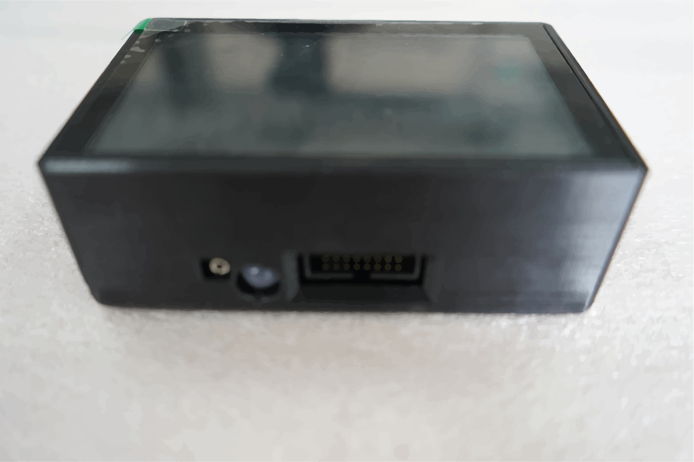

Adaptateur secteur USB-C
------------------------

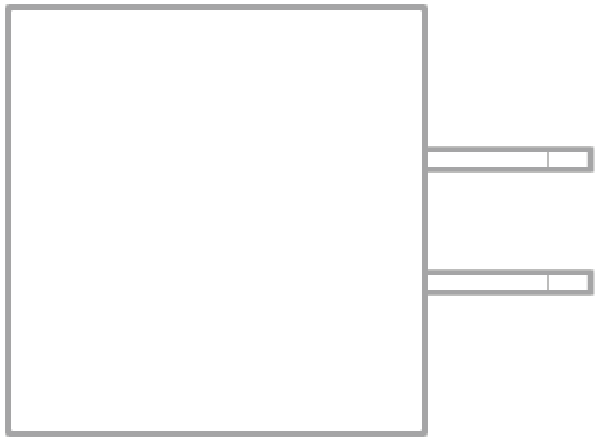

Câble d'alimentation USB-C
--------------------------

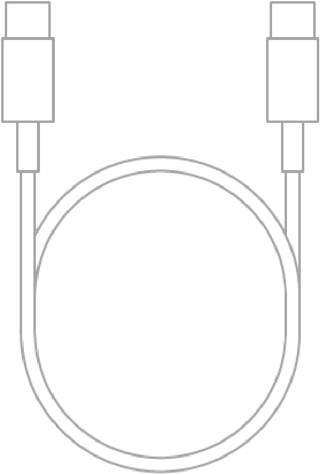

Chassis de support du Dôme
--------------------------

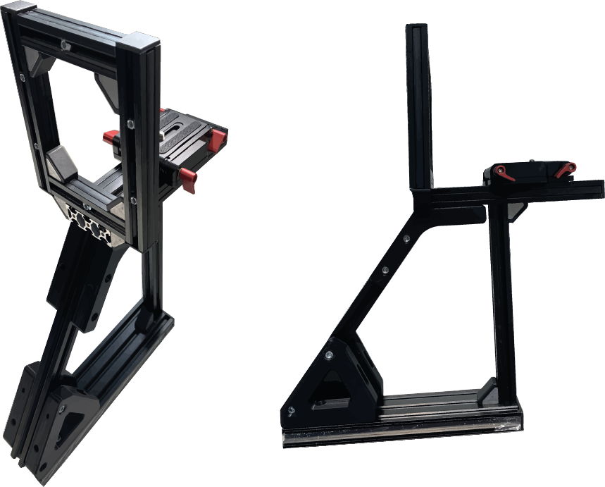

Visserie et nappes
------------------

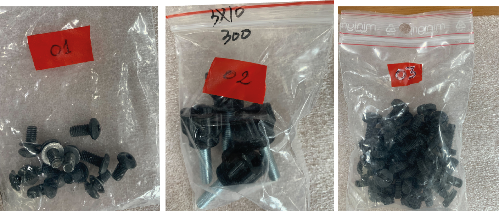

Accessoires non fournis 
=======================

Le trépied vidéo et la rotule
-----------------------------

Vous pouvez consulter ces accessoires via ce lien :
[L](https://amzn.to/3KdzFt3)a platine de montage de la rotule sera fixée
sur la partie inférieure du chassis

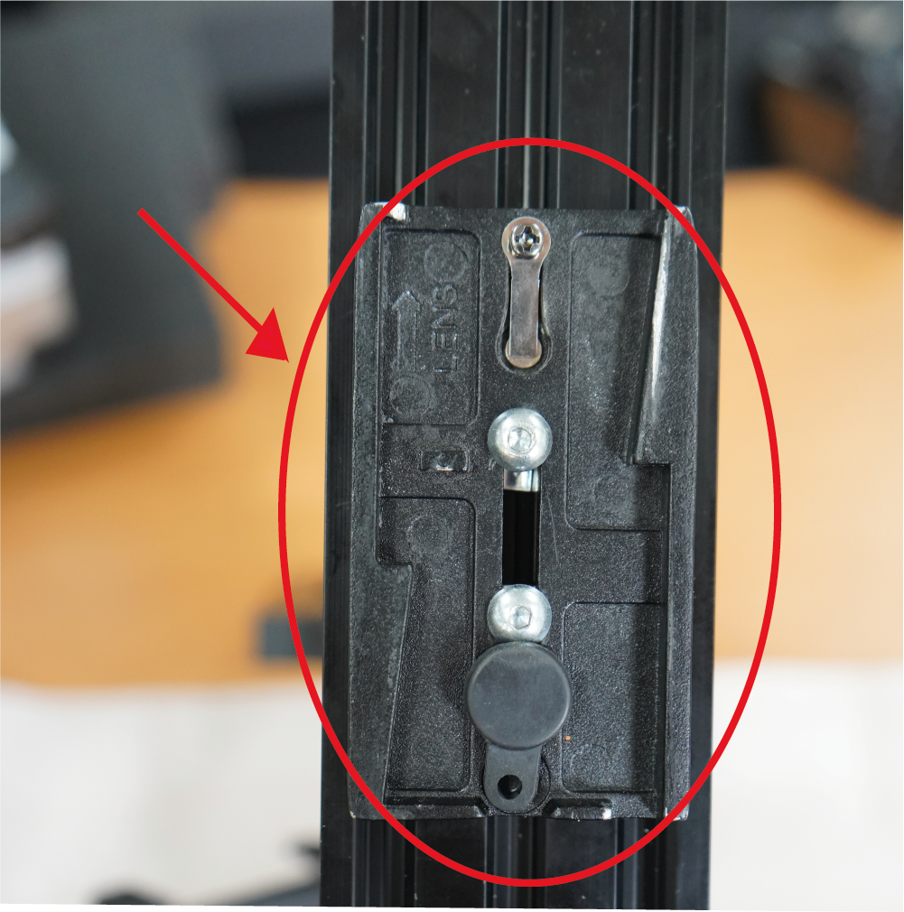

L'appareil photo numérique 
--------------------------

Montage du grand Dôme Mercurio 
==============================

{#fig:leds}

Ne pas toucher les LEDs. Faire attention dans toutes les manipulations
qui vont suivre, ces LEDs de très haute puissance et grande qualité sont
extrêmement sensibles et fragiles.

Montage du chassis 
------------------

Avant de commencer le montage, munissez-vous d'un trépied. La première
pièce à monter est le chassis du dôme (voir la figure
[4](#fig:support_dome){reference-type="ref"
reference="fig:support_dome"}) :\

{#fig:support_dome}

Commencez par monter la platine de la rotule vidéo sur le trépied,
suivez les indications illustrées sur la figure
[5](#fig:steps){reference-type="ref" reference="fig:steps"} :\

{#fig:steps}

{#fig:sup_tr}
{#fig:sup_tr}

Après avoir monté le chassis sur le trépied, il faut assembler le
premier pentagone sur la façade dans laquelle vous allez visser les bras
du dôme (voir la figure [8](#fig:façade){reference-type="ref"
reference="fig:façade"}) :

{#fig:façade}

Montage de la plaque centrale 
-----------------------------

En utilisant les 6 vis N° 01, et la clé Allen, vissez la plaque (voir la
figure [10](#fig:penta){reference-type="ref" reference="fig:penta"}) en
pentagone sur le support (voir la figure
[11](#fig:plaque_etsupport){reference-type="ref"
reference="fig:plaque_etsupport"}).

{#fig:penta} {#fig:penta}

Pensez à respecter le sens de la plaque, pour cela, veuillez tourner la
plaque et voir le sens du texte.

{#fig:plaque_etsupport}

Montage des bras
----------------

ATTENTION A NE PAS TOUCHER LES LEDS. LES LEDS SONT TRÈS FRAGILES

Montez le premier bras sur le chassis. Celui ci est différent des 4
autres, il possède 4 trous sur l'hexagone pour pouvoir le relier au
chassis.

En utilisant les longues vis N° 02, vissez d'abord l'hexagone sur le
chassis. Puis en utilisant les 4 vis N° 03, vissez le bras avec la
plaque centrale. Suivez les étapes illustrées sur la figure
[12](#fig:bras_1){reference-type="ref" reference="fig:bras_1"} :

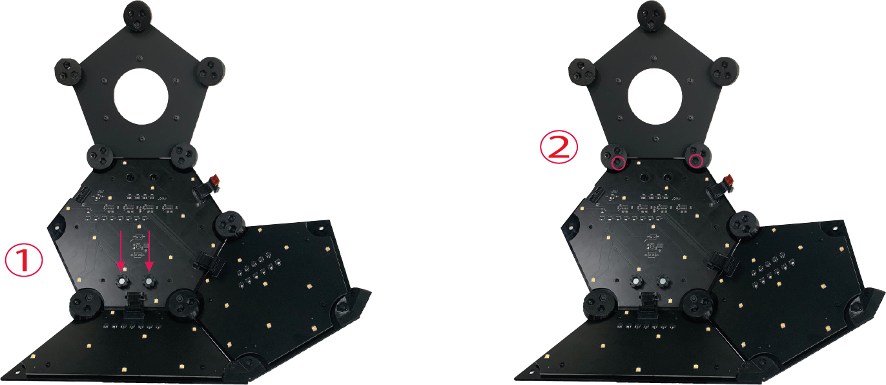{#fig:bras_1}

Ensuite, terminez cette étape en vissant le bras avec le chassis comme
l'indique la figure [13](#fig:bras_12){reference-type="ref"
reference="fig:bras_12"}.

{#fig:bras_12}

Complétez les étapes en mettant le 2ème bras la figure, vissez ce bras
avec le bras déjà monté et le plaque centrale, voir la figure
[13](#fig:bras_12){reference-type="ref" reference="fig:bras_12"}.\
En poursuivant avec le troisième bras, vissez chaque bras le précédant
ainsi avec la plaque centrale.

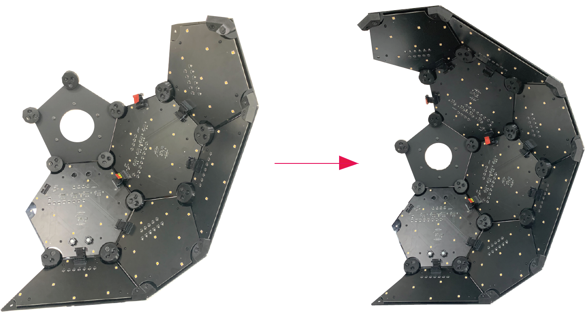{#fig:bras_2}

Avant de mettre le dernier bras, pensez à connectez la grande nappe avec
le premier bras, voir la figure
[15](#fig:bras_nappe){reference-type="ref" reference="fig:bras_nappe"}.

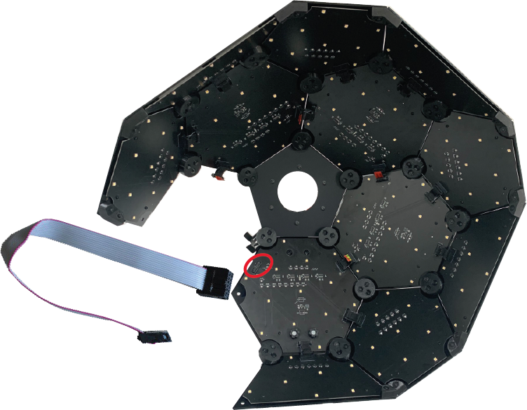{#fig:bras_nappe}

Complétez le montage en insérant le dernier bras.

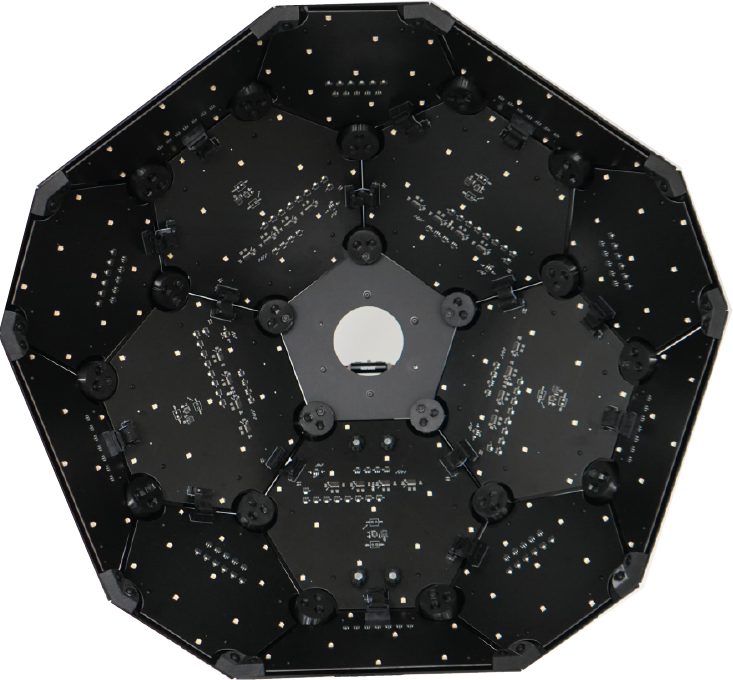{#fig:dernier_bras}

Montage des bras : Instructions pour visser les bras 
----------------------------------------------------

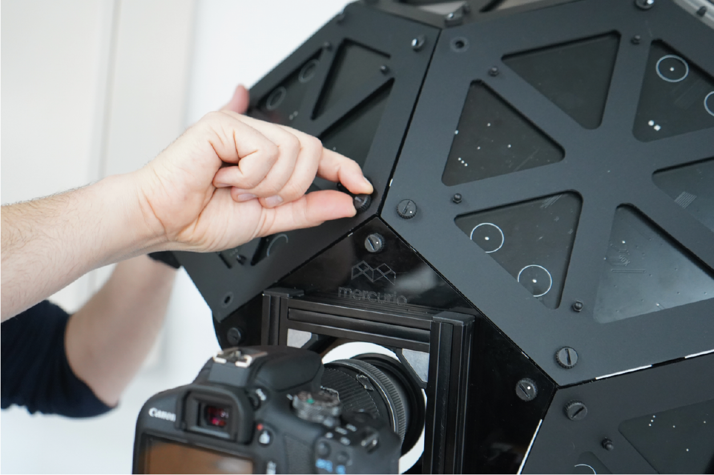{#fig:visser_plaque}

{#fig:visser_plaque2}

Les vis avec les points blancs sont des vis fixes, veuillez ne pas
visser/dévisser ces vis pour le montage/démontage. Pour le
montage/démontage du dôme, vissez/dévissez uniquement les vis sans
points blancs.

Montage des bras : Instructions pour connecter les nappes 
---------------------------------------------------------

{#fig:napppes}

Lors de la connexion des bras via les nappes, veuillez garder les cotés
noir des nappes attachés aux bras, et détacher/attacher uniquement les
cotés rouges.

Montage du boîtier de contrôle et de la caméra
----------------------------------------------

{#fig:last_montage}

{#fig:last_montage}

Afin de compléter le montage, veuillez visser la caméra sur le support
comme l'indique la figure [21](#fig:last_montage){reference-type="ref"
reference="fig:last_montage"}, placez le boîtier de contrôle dans son
emplacement et connectez le avec le dôme via la nappe.

**Remarques**\

-   Ne pas bouger le dôme durant les acquisitions,

-   Désactiver les stabilisations automatiques de la caméra, désactivez
    aussi l'autofocus,

-   Ajustez le netteté de l'image sur la caméra avant de commencer une
    acquisitions.

**Rappel**\

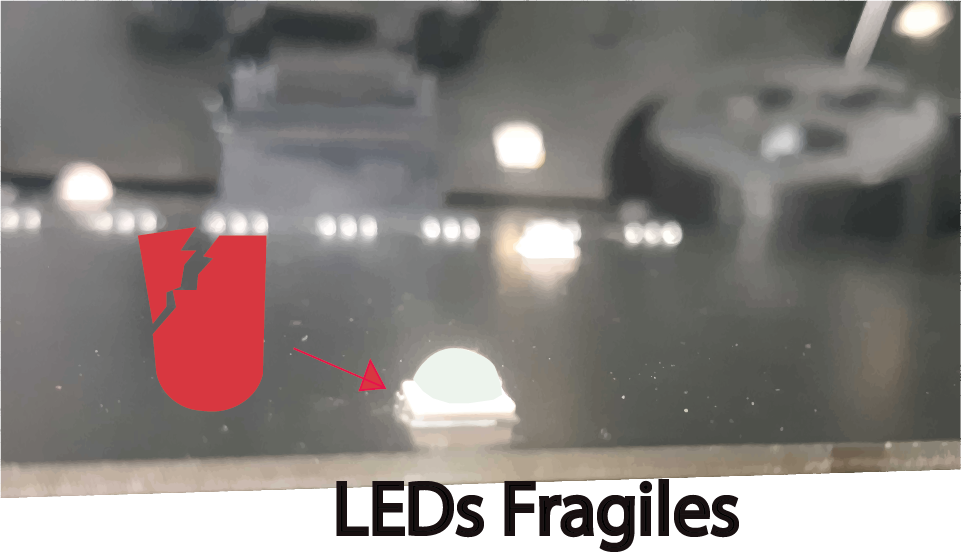

Démontage du grand Dôme Mercurio
================================

Le démontage du grand Dôme passe par les étapes suivantes :

1.  Détachez les nappes des bras (Pensez à détacher uniquement les
    parties colorées en rouge), voir la figure
    [22](#fig:dm){reference-type="ref" reference="fig:dm"},

    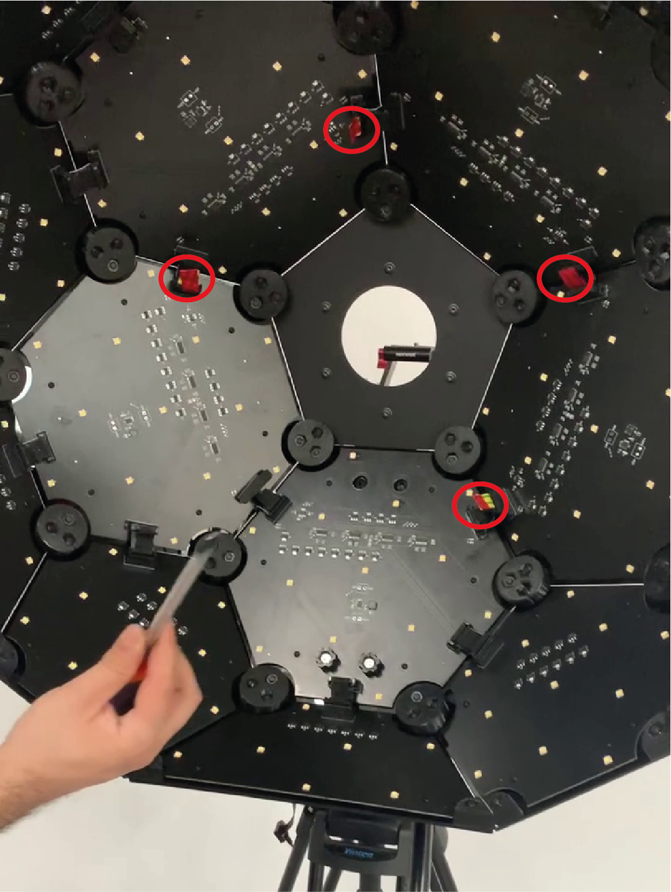{#fig:dm}

2.  Utilisez un tournevis pour dévissez les vis au dos du dôme. Ne pas
    dévisser les vis qui ont des points blancs.

    {#fig:dv}

3.  Séparez les bras détachés et suivez les étapes jusqu'au dernier
    bras,

    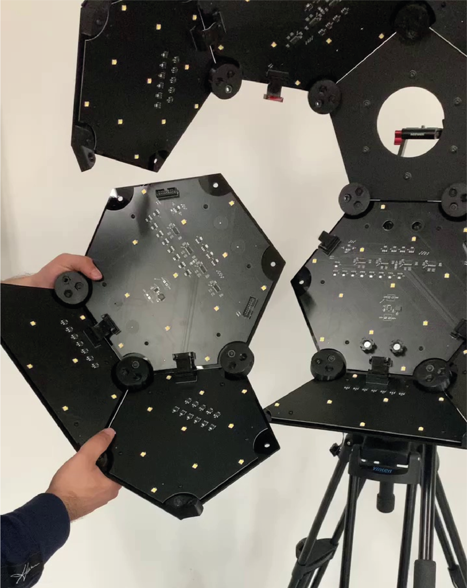{#fig:dtc}

4.  Dévissez les vis N° 02 (entre le bras et le support), et détachez le
    bras,

    {#fig:bras_centre}

5.  Dévissez la plaque (pentagone central) en dévissant les vis N° 01,

    {#fig:penta_centre}

6.  Dévissez et détachez le support du boîtier de contrôle,

    {#fig:sprt_bo}

Emballage du dôme
=================

Pour ranger le dôme, vous disposez d'une malle de rangement.

{#fig:malle}

Malle du dôme
-------------

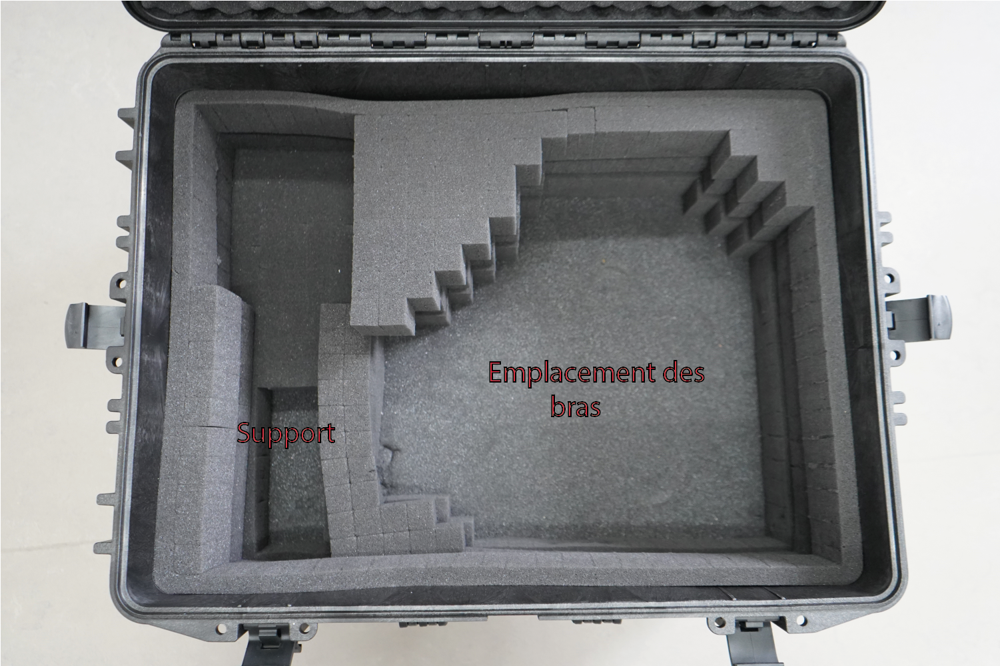{#fig:malle_vide}

Étapes du rangement
-------------------

{#fig:etapes_rangement}

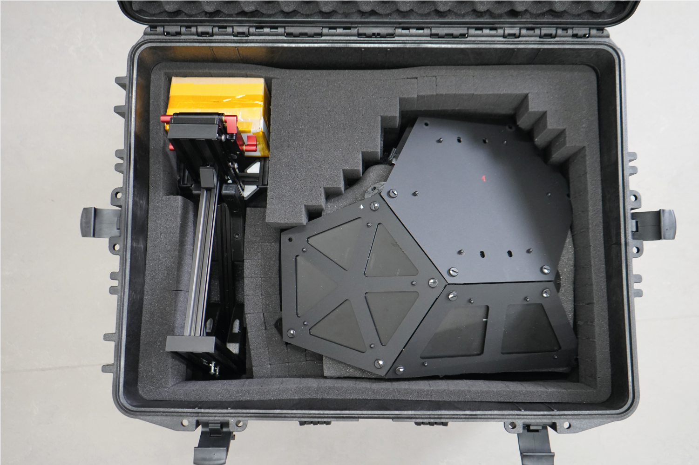{#fig:_rangement}

Le dôme est dans la malle !
---------------------------

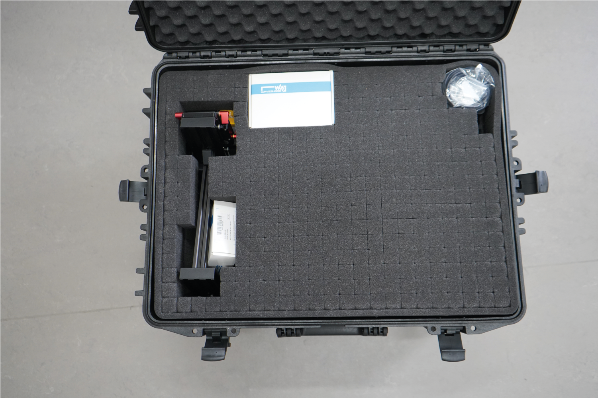{#fig:_rangement_}

**Remarques**

-   Veuillez ranger les bras un par un, et mettre la couche isolante,

-   Mettre chaque pièce dans son emplacement indiqué.

À propos de l'application Mercurio Dôme V1
==========================================

L'application **Mercurio Dôme V1** est développée afin d'automatiser le
processus d'acquisition. Cet outil logiciel permettant d'enregistrer,
d'analyser et de communiquer les données relatives aux objets capturés.

    │   └── rti/
    │       ├── PROJET <NomDeProjet>
    │       │   ├── image.JPG
    │       │   ├── LP.lp
    │       │   ├── metadonnees.json
    │       │   ├── rti/

Les images capturées sont stockées dans le dossier \"rti\".\
Le fichier \"LP.lp\" contient les positions des lumières du grand Dôme.\
\"metadonnee.json\" contient les données relatives à l'utilisateur, à
l'objet et à l'environnement.\

Guide d'utilisation de l'interface \"Mercurio Dôme V1\"
=======================================================

Le boîtier de l'interface 
-------------------------

L'interface utilisateur est mise dans un boîtier de protection (Voir la
figure [33](#fig:interface_ui){reference-type="ref"
reference="fig:interface_ui"} ),

{#fig:interface_ui}

-   **Bouton 1**, **Bouton RESET** Sert à réaliser le **RESET** de la
    carte de contrôle.

-   **Bouton 2** : Bouton de redémarrage/fermeture de l'application,
    Maintenir quelques secondes pour le **redémarrage**, et maintenir
    longtemps pour **éteindre**.

Pour **redémarrer** l'application, le bouton 2 doit rester appuyé au
moins pendant **2 Secondes**, et pour **éteindre**, le bouton 2 doit
rester appuyé au moins pendant **6 Secondes**.

{#fig:interface_io}

-   **Alimentation**, Le dôme est alimenté par une source de type C.

-   **Connecteur de Dôme**, Emplacement pour mettre le câble (nappe) de
    connexion entre le boîtier de contrôle et le Dôme.

-   **LED RGB**, LED qui clignote pour indiquer le fonctionnement des
    tâches.

-   **Adaptateur Jack**, Pour la connexion entre le boîtier de contrôle
    et une caméra. Inutilisé pour le cas de ce Dôme.

Dans le cadre de ce Dôme, l'adaptateur Jack est inutile car la caméra
doit être connectée via USB.

{#fig:interface_iot}

L'interface USB permet l'échange d'informations entre des appareils
extérieurs (Caméra, Clé USB\...). La caméra doit être connectée sur l'un
des ports USB.

-   **L'entrée Ethernet** permet de connecter la carte de contrôle au
    réseau internet ou aux autres appareils. Cette carte dispose de la
    capacité d'être connectée via le **WiFi**.

-   **USB 2.0** permet un transfert de données relativement lent.

-   **USB 3.0** permet un transfert de données relativement rapide.

Caractéristiques de la carte de contrôle du Dôme
------------------------------------------------

-   Écran LCD 5 Pouces, 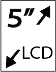

-   Connexion WiFi 

Guide de l'interface UI
-----------------------

### Alimentation et branchement du boîtier

D'abord, pour utiliser l'application **\"Dôme\"**, Branchez le câble
d'alimentation de type C (Voir la figure
[36](#fig:charge){reference-type="ref" reference="fig:charge"}) :

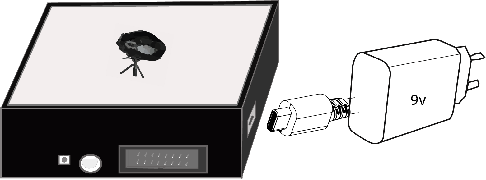{#fig:charge}

La tension électrique requise est de 9 volts minimum.\

Avant de lancer l'application \"Dôme\", veuillez réaliser les
branchement suivant (voir la figure
[37](#fig:branch){reference-type="ref" reference="fig:branch"}) :

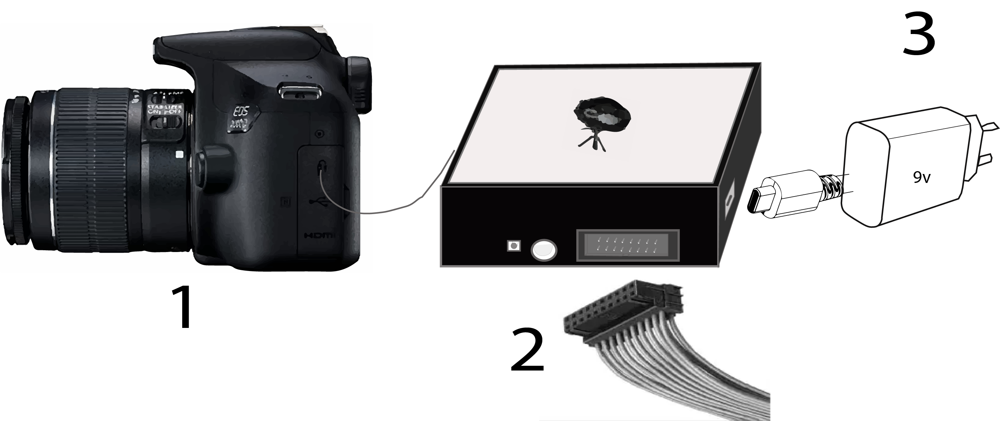{#fig:branch}

**1** - Branchez la caméra via le câble,\

**2** - Branchez la nappe entre le connecteur sur le boîtier et le
connecteur qui se trouve sur la première plaque du Dôme,\

**3** - Branchez le câble d'alimentation.

### Lancement de l'application

Pour lancer l'application, il faut appuyer sur l'icône \"Dôme\" (voir la
figure [38](#fig:icon){reference-type="ref" reference="fig:icon"}) qui
se trouve sur le bureau :

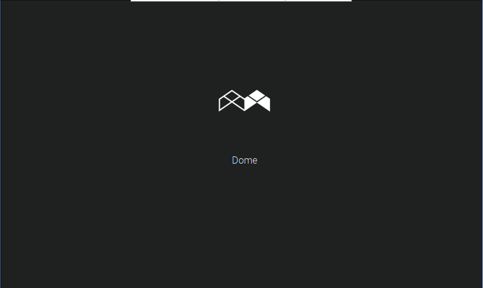{#fig:icon}

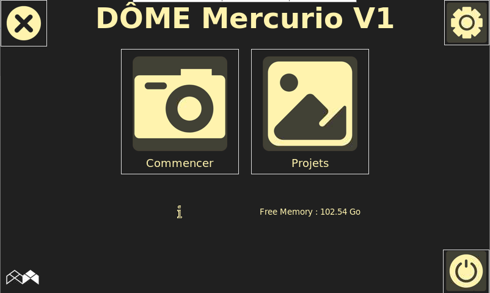{#fig:main}

### Menu Réglages

L'icône des Réglages permet de régler les fonctionnalité du Dôme.

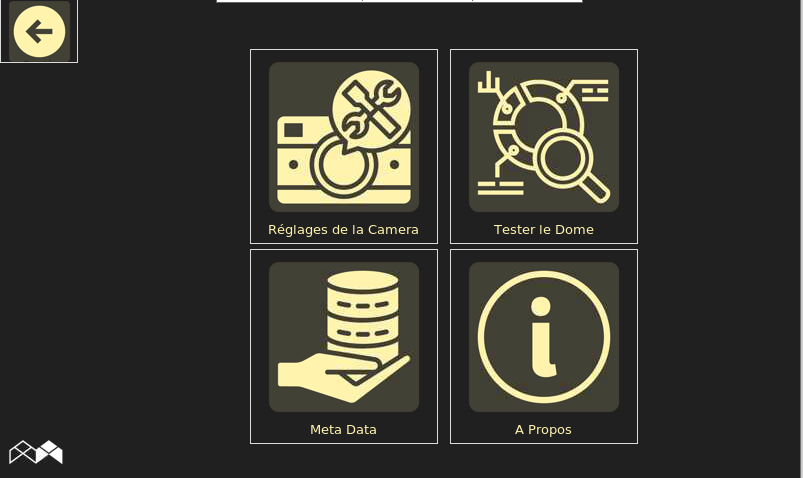{#fig:main_reg}

On trouve dans le menu \"Réglages\" 4 sous-menus :

-   **Réglage de la caméra**, permet le configuration des paramètres de
    la caméra connectée au boîtier.

-   **Tester le Dôme**, permet de tester l'allumage des LEDs du grand
    Dôme.

-   **Meta Data**, Contient les données relative à l'utilisateur et
    l'environnement des captures,

-   **A propos**, Affiche les données relatives à la version de
    l'application.

```{=html}
<!-- -->
```
-   **Réglage de la caméra**

{#fig:cameratest}

\"aperture\", indique l'ouverture de la caméra,\

\"shutterspeed\", indique le temps de pause de la caméra\

\"whitebalance\", indique la balance des blancs\

En appuyant sur l'une des valeurs, la caméra reçoit immédiatement la
valeur sélectionnée. En sortant, les valeurs seront enregistrées.

-   **Tester le dôme**

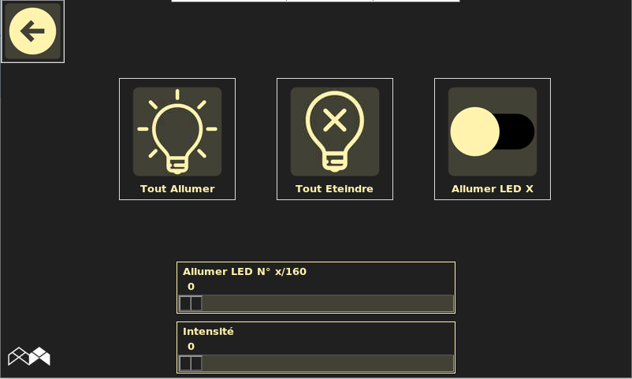{#fig:testdome}

La sélection de l'option \"allumer LED x\", activera le widget \"Allumer
LED N x/160\" qui permet de choisir l'indice de la LED à allumer sur le
Dôme (voir la figure [44](#fig:testdomeLEDx){reference-type="ref"
reference="fig:testdomeLEDx"})

{#fig:testdomeLEDx}

{#fig:testdomeLEDx}

Pour Allumer toutes les LEDs du Dôme, sélectionnez le bouton \"Tout
Allumer\", cela activera le widger de l'intensité pour contrôler
l'intensité d'allumage :

{#fig:testdomeLED}

**Remarque** : Veuillez ne pas laisser les LEDs allumées pendant
longtemps.

-   **Configuration des méta données**

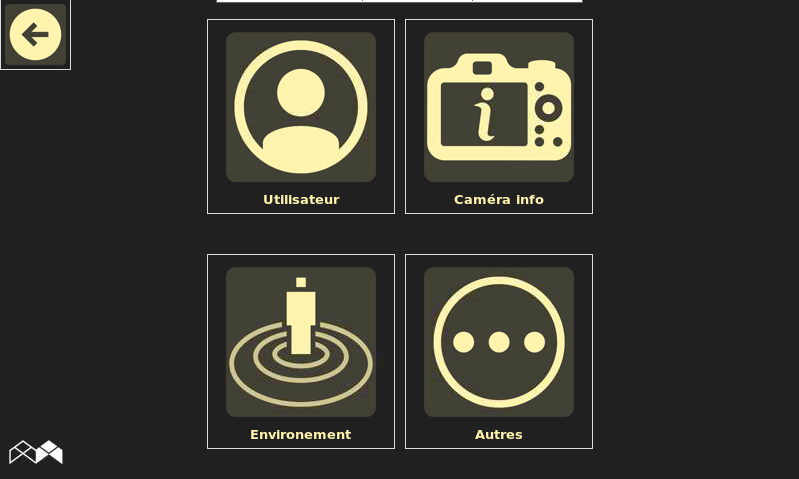{#fig:metadata}

Le menu \"Utilisateur\" contient les champs suivants (voir la figure
[47](#fig:users){reference-type="ref" reference="fig:users"}) :

{#fig:users}

Dans cette section, l'utilisateur pourra modifier les valeurs dans les
champs et enregistrer. Une fenêtre apparaît pour indiquer la prise en
compte des nouvelles données (voir la figure
[48](#fig:users_save){reference-type="ref" reference="fig:users_save"}).

{#fig:users_save}

Après l'affichage du message de la figure
[48](#fig:users_save){reference-type="ref" reference="fig:users_save"},
il faut revenir au menu précédant par la flèche en haut à gauche.

Le menu \"Environnement\" décrit les données liées à l'environnement et
au contexte du projet.

{#fig:envi}

Le menu \"Caméra info\" montre les configurations de la caméra pour les
prises de vues.

{#fig:camera_data}

Le menu \"Autres\" montre les configurations du dossier de sauvegarde et
la valeurs de l'intensité d'allumage durant la prise de vue.

{#fig:autres}

### Menu Commencer

L'icône **\"Commencer\"** permet de lancer un projet d'acquisition.\
Pour lancer un projet d'acquisition, rendez-vous sur l'icône
\"Commencer\", Une fenêtre s'affiche (Voir la figure
[52](#fig:menulancer){reference-type="ref" reference="fig:menulancer"}),

{#fig:menulancer}

-   **Nom du Projet** : C'est la case où s'affiche le nom donné au
    projet en cours,

-   **Icône \"Changer\"**, Permet de changer le type d'acquisition
    (Rapide ou Dense), Voir la figure [53](#fig:Aq){reference-type="ref"
    reference="fig:Aq"},

-   Bouton **\"Lancer une acquisition\"**, permet de lancer
    l'acquisition.

Par défaut, le type d'acquisition est programmé au type \"Rapide\", Pour
changer le mode d'acquisition, il faut se rendre sur le bouton
**\"Changer\"** et choisir le mode \"Dense\", voir la figure
[53](#fig:Aq){reference-type="ref" reference="fig:Aq"} :

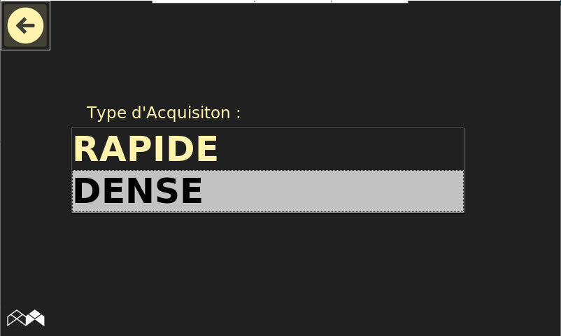{#fig:Aq}

**Remarque :** Il suffit de quitter la fenêtre afin de sauvegarder le
type d'acquisition choisi.

### Menu Projets

L'icône **\"Projets\"** permet de visualiser les projets réalisés.

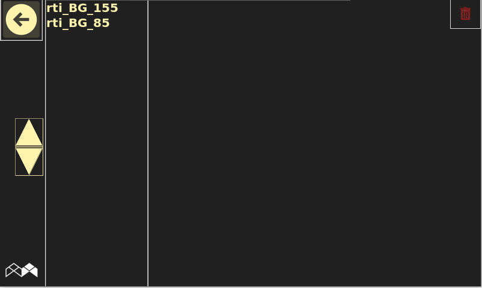{#fig:projets}

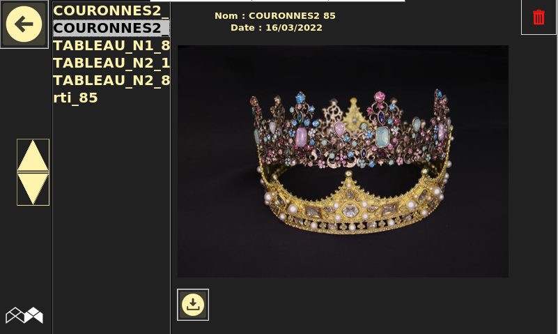{#fig:projets_vis}

On peut supprimer ou télé-charger un projet sélectionné, pour
télé-charger, il suffit de mettre une clé USB, de préférence dans une
sortie de USB 3.0 (Sotie USB en Bleu).

{#fig:projets_sup}

{#fig:projets_dow}

### Menu Quitter

L'icône de Sortie permet de quitter l'application.

### Menu Éteindre

L'icône d'arrêt permet d'éteindre l'appareil.

Remarques
=========

-   Branchez d'abord la caméra avant de lancer l'application,

-   Allumez la caméra avant de lancer l'application,

-   Il ne faut pas toucher le Dôme en cours d'acquisition,

-   Prévoir une clé USB de 2GO d'espace libre minimum,

-   Ne pas laisser les LEDs allumées pendant très longtemps.

-   Évitez d'appuyer sur les LEDs.

Mise à jour de l'application
============================

Pour mettre à jour l'application, il faut se rendre dans le menu **A
propos** (voir [58](#fig:maj){reference-type="ref"
reference="fig:maj"}):

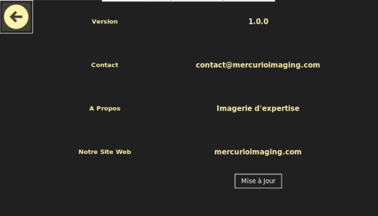{#fig:maj}

Avant de procéder à la mise à jour, il faut d'abord se connecter à votre
réseau WiFi, Appuyer sur **OK** pour Valider, Cette opération se fait
une fois, si l'appareil est connecté, cette fenêtre ne s'affiche pas :

{#fig:maj_wifi}

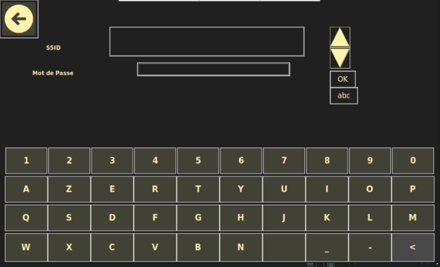{#fig:maj_clavier}

Une fois connecté, la mise à jour se fait en se rendant dans la fenêtre
\"A propos\", puis appuyer \"Mise à jour\".

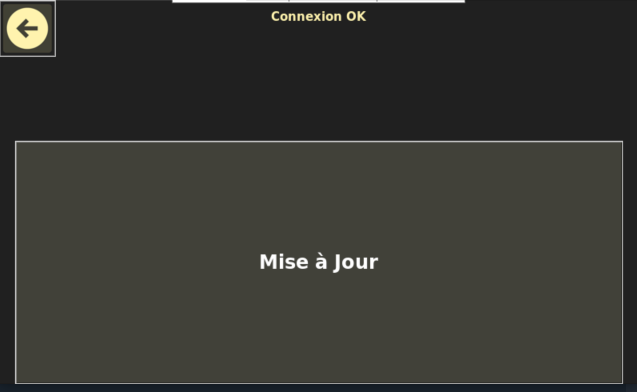{#fig:MAJOK}

Une fois que vous choisissez de mettre à jour l'application, il faut
prévoir **1 à 2 minutes** avant que les fichiers soient copiés.

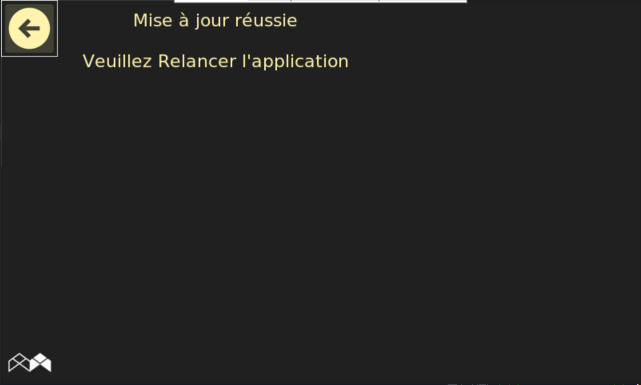{#fig:MAJFINI}

La fenêtre ([62](#fig:MAJFINI){reference-type="ref"
reference="fig:MAJFINI"}) indique la fin de la mise à jour, pour finir
les étapes de cette dernière, il faut fermer toutes les fenêtres et
relancer l'application.

Instructions
============

Assurez-vous que votre caméra est dans la liste des caméras supportées :
<http://www.gphoto.org/proj/libgphoto2/support.php>

Acquisition des images : Instructions pour les prises de vues
-------------------------------------------------------------

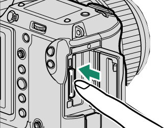{#fig:carteSD}

{#fig:stabil}

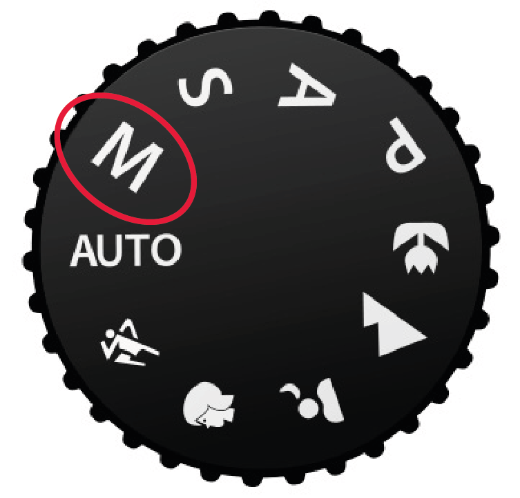{#fig:ManuelM}

{#fig:position}

{#fig:fond}

Sécurité et bonnes pratiques
----------------------------

{#fig:leds}

Ne pas toucher sur les LEDs. Faire attention dans toutes les
manipulations
